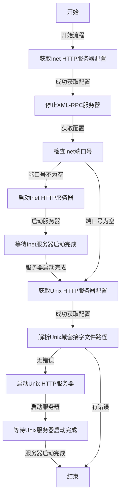

# supervisord

## 系统启动

- **setSupervisordInfo()**: 设置supervisord的基本信息
- **startEventListeners()**: 启动事件监听器，用于监控程序状态变化
- **createPrograms()**: 根据之前的程序配置创建程序实例
- **startHTTPServer()**: 启动HTTP服务器，提供Web管理界面或API
- **startAutoStartPrograms()**: 启动配置为自动启动的程序

### startEventListeners

1. **获取事件监听器配置**：通过`s.config.GetEventListeners()`获取所有配置的事件监听器列表
2. **遍历创建进程**：对每个事件监听器配置项，使用进程管理器创建对应的进程
3. **启动进程**：调用`proc.Start(false)`启动每个事件监听器进程，参数`false`表示非阻塞启动
4. **等待稳定**：如果存在事件监听器，等待1秒钟确保所有进程启动稳定

### createPrograms

1. **获取程序名称**：首先，通过调用`s.config.GetProgramNames()`方法获取当前配置中所有的程序名称，并存储在`programs`变量中。
2. **创建程序**：然后，通过遍历`s.config.GetPrograms()`获取的所有程序配置条目，调用`s.procMgr.CreateProcess`方法为每个程序创建一个进程。这里，`s.GetSupervisorID()`方法用于获取当前Supervisor的ID，`entry`是程序配置条目。
3. **移除不再需要的程序**：接下来，使用`util.Sub(prevPrograms, programs)`方法计算之前存在的程序（`prevPrograms`）和当前程序（`programs`）之间的差异，得到那些不再需要的程序列表`removedPrograms`。
4. **移除程序**：最后，遍历`removedPrograms`列表，调用`s.procMgr.Remove`方法移除这些不再需要的程序。

### startHTTPServer

### startAutoStartPrograms

​	startEventListeners，createPrograms，startAutoStartPrograms处理逻辑都集中到s.procMgr.CreateProcess中procMgr模块。

​	startHttpServer一个是启动webui的InetServer，一个是启动基于unix domain sock的http服务，xml跑着http上。

处理逻辑都集中到这里，区别就是输入的协议protocol不同，一个是unix，一个是tcp

### http路由

####  RPC2

xmlrpc在启动时，会注册一下处理函数和别名

xmlrpc使用的是  github.com/divan/gorilla-xmlrpc/xml

第一个参数是别名，第二个参数是注册的模块的函数，即Supervisor结构体中对应的函数。

####　/program/

program的启停查

#### /supervisor/

supervisor自身的reload和停止

#### /logtail/

日志api

## 总结

* 不论是以inet启动的服务，还是以sock启动的服务，都是在http上运行，xmlrpc是基于http。
* 控制面都是通过http请求进行，数据面都是通过xmlrpc进行。

